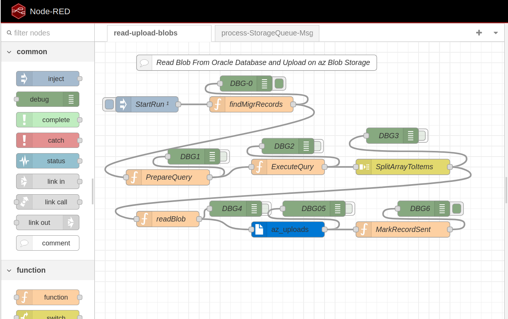
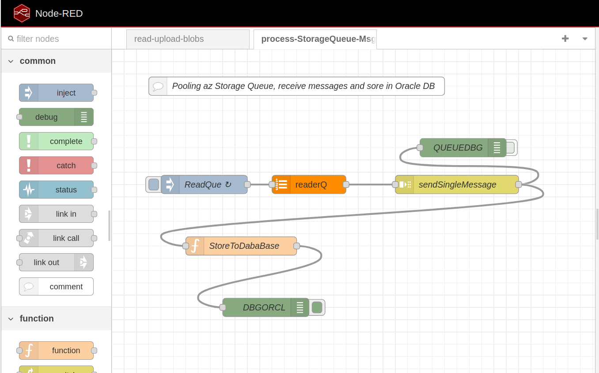

# oracle-db-container

This is part of the educational project described at the link [AZURE AZ-204 AZ BLOB STORAGE - educational project](https://pavlo-shcherbukha.github.io/posts/2025-10-16/az-204-blob-strg-en/), which implements components from the "OnPremise Datacenter" group, see the architecture: [pic-03 generalized architecture for migration from a database to the cloud Azure Blob Storage](https://pavlo-shcherbukha.github.io/assets/img/posts/2025-10-16-az-blobstrg/doc/pic-03.png)

## Obtaining an ORACLE DB image from the official ORACLE website

As far as I can tell, you can only get an ORACLE database image from the official ORACLE docker registry.
I didn't find any official ORACLE database images on Docker HUB. The non-official ones were 5-7 years old, i.e. outdated.
Therefore, before talking about getting a database, you need to create an account on [ORACLE CLOUD](https://cloud.oracle.com). When you register, ORACLE will require you to install the **Oracle Authentificator** application on your mobile device for multi-factor authentication.

When you already have an account in ORACLE CLOUD, you can connect to the oracle docker registry.
To do this, go to https://container-registry.oracle.com [pic-01](#pic-01).


<kbd></kbd>
<p style="text-align: center;"><a name="pic-01">pic-01</a></p>


In the Databases section you can see the occupied databases on the following days:
- **adb-free**	Oracle Autonomous Database Free;
- **express** Oracle Database Express Edition;
- **free**	Oracle Database Free.

<kbd></kbd>
<p style="text-align: center;"><a name="pic-02">pic-02</a></p>


But to access the repository, you need to go to your profile and generate a token that will be used as a password when logging into the repository and only then can you connect to the repository and receive image

I will use racle Database Express Edition for experiments - as the simplest and smallest.

- **Connecting to the repository**


```bash
$ docker login container-registry.oracle.com
# We can see in console  request to enter login and password. The password is  the token jast has generated,
login: <your repo login>
password: <your repo  auth token>

```

And only then do we get the database image locally. The image is quite large, so it's easier to first get it locally and only then create the container.

**Getting a database image**

```bash

# get image
$ docker pull container-registry.oracle.com/database/express:latest

# check image's existance
$ docker image ls
REPOSITORY                                       TAG              IMAGE ID       CREATED         SIZE
container-registry.oracle.com/database/express   latest           8da8cedb7fbf   2 years ago     11.4GB
$ 
```


- **Start container**

To prepare a directory where the database data will be stored, I followed the recommendations, but in a simplified form

```bash
$ sudo mkdir oracle 
$ cd oracle
$ sudo mkdir oradata 

$ sudo chmod -R 777 /opt/oracle
$ sudo chmod -R 777 /opt/oracle/oradata
```

```bash
# create a volume to store database data. This will avoid problems with free space in /var/lib.
docker volume create oracle_db_data

# run container
docker run -d --name shodcldb 
 -p 1521:1521 -p 5500:5500 
 -v oracle_db_data:/opt/oracle/oradata 
 -e ORACLE_CHARACTERSET=AL32UTF8 
 container-registry.oracle.com/database/express

```

- **View container log**

The first time you run Oracle Express Edition inside a Docker container, it performs a configuration process that can take some time. Review the logs to make sure the database is ready to use:

```bash
docker logs -f shodcldb

```

You can continue working with the database when you see messages like:

        DATABASE IS READY TO USE!

        Setup complete. Database ready to use.

After this message appears, you can connect to the database on ports 1521 (SQL*Net) and 5500 (Enterprise Manager PDB).


- **Stop  Container**

```bash
docker stop shodcldb 

```

- **Start  container (reuse container)**

```bash
docker start shodcldb 

```


## Configuring a database running in a container

First of all, you need to set a password for SYS, SYSTEM. To do this, you need to go into the container and run the existing sh scrip

### **Setting Administrator Passwords**

```bash
# Generalized command
# docker exec <oracle-db> ./setPassword.sh <your_password>

# command according to the name of the running container

docker exec  shodcldb ./setPassword.sh <пароль адміністраторо>

# we check the possibility of connecting to the database from inside the container

docker exec -it shodcldb sqlplus system/<пароль адміністратора>@XE


```

### **Creating local database users**

Here, there are differences from the usual approach for enterprise developers. Well, or, DBAs have known them for a long time, but developers are usually separated from the database (as well as users) so they did not feel them. Here I mean more myself than general practice.

When you connect to ORACLE with this command


```bash
docker exec -it shodcldb sqlplus system/<пароль адміністратора>@XE
```

and try to create a database user, for example with this script,

When you connect to ORACLE with this command


```sql
CREATE USER NODEREDAPP1 IDENTIFIED BY "<password>";
GRANT CONNECT            TO NODEREDAPP1;
GRANT ALTER SESSION      TO NODEREDAPP1;

```

you will get the error **ORA-65096: invalid common user or role**. The error occurs because you are trying to create a local user (not common) in the CDB (Container Database) or in the Root Container (CDB\$ROOT) instead of creating it in the PDB (Pluggable Database). Starting with Oracle 12c, the Multi-tenant (CDB/PDB) architecture requires the following rules to be followed:
1. Connection point (Connect to PDB)
You must be connected to the Pluggable Database (PDB), not to the root container (CDB\$ROOT).
If you are using **Oracle XE** or **Free**, then **PDB** is usually called **XEPDB1** or **FREEPDB1**.
And before creating a user or executing other DDL scripts, you must connect (make sure that you are connected) to the desired PDB. If you do not switch to the PDB, you will not see either your database objects or the users you created. Theoretically, the requirement to switch to PDB sounds clear, but a natural question arises: "How to connect to the database as a regular user?".
The fact is that PDB acts as a kind of **Service Name** of the database and in the connection string instead of Service Name you need to put PDB, so here are examples:

- example of running sqlplus with a database connection (for ORACLE XE).
```bash
sqlpus username/password@localhost:1521/XEPDB1

```

Або ж

```bash
sqlplus system/ваш_пароль@XE/XEPDB1

```

- example of connecting to a database from an already running sqlplus (for ORACLE XE).

```sql
connect username/password@localhost:1521/XEPDB1
```

or

```bash

SQL> CONNECT system/password@XE
SQL> ALTER SESSION SET CONTAINER = XEPDB1;
SQL> SHOW CON_NAME;
-- XEPDB1

```

### Executing DDL/SQL scripts on the database

If I run the database in a container, I have no motivation to deploy the oracle client and configure TNS NAME. One method to do this, and quite convenient, is to copy the scripts to the container, and then go into the container and run SQL and with it the scripts to execute.

For example, here the DDL scripts are in the **oracle-ddl** directory and the scripts are arranged in subdirectories. Everything is run through a single **run.sql**


- copying scripts to the container file system

```bash
# There is fill path hould be
docker cp -a /home/.../oracle-ddl/. shodcldb:/home/oracle/

```

- run script

```bash
docker exec -it shodcldb /bin/bash -c "sqlplus SYSTEM/1Qazxsw2@localhost:1521/XEPDB1 @/home/oracle/run.sql"

```

Although, wait a minute!
Before writing scripts, you need to:

1. create a schema owner and grant him rights:

```bash
docker exec -it shodcldb /bin/bash -c "sqlplus SYSTEM/1Qazxsw2@localhost:1521/XEPDB1 @/home/oracle/SCHEMA.SQL"

```

2. create application users and assign them the correct roles:

```bash
docker exec -it shodcldb /bin/bash -c "sqlplus SYSTEM/1Qazxsw2@localhost:1521/XEPDB1 @/home/oracle/APPUSERS.sql"

```

After executing the script, you remain in SQLPLUS and can make SQL queries to the database, and then exit the container and sqlplus by **EXIT**.

You can simply go into the container and view the script execution log, or delete them by executing the search command:

```bash
docker exec -it shodcldb /bin/bash

```

## Connecting to a database using Jupyter Notebook

- **Creating a virtual environment**

```bash
python3 -m venv env

```

- **Virtual environment activation (Linux)**

```bash
source env/bin/activate
```

- **Installing required packages**

```bash

pip install -r requirements.txt
```

- **Launch Jupyter Notebook**

```bash
jupyter notebook
```

- **List and purpose of written NoteBooks**

    - test-oradb.ipynb check database connection
    - db-dictionary.ipynb get dictionaries of applied tables
    - load-test_data.ipynb prepare and load test data into application tables
    - check_migration.ipynb control over application execution (migration control)

As it turned out, using jupyter notebook is a worthy replacement for using all sorts of data explorers out there.


## Node-Red application backup

Node-Red application has 2 custom nodes in the directory: nodered-srvc/shazblob.
therefore, first of all
- go to nodered-srvc/shazblob and execute

```npm install
```

- after that go up one step: (go to nodered-srvc) and also execute

```
npm install

```

After that, you can run Node-Red (from the nodered-srvc directory) with the command

```
npm run dev
```

And, before working,
- you need to replace ****** with your password to the database in the nodes that work with the ORACLE database
- you need to configure the configuration node to work with azure blob storage


## Node-RED 

### Flow: read-upload-blobs - читає з бази даних записи з Blob  полями та завантажуєе дані з Blob  на azure Blob Storage

<kbd></kbd>
<p style="text-align: center;"><a name="pic-03">pic-03</a></p>


### Flow: process-StorageQueue-Msg - process-StorageQueue-Msg Читає повідомлення із Azure Storage Queue  та записує елементи повідомлення в базу даних oracle (робить insert  в таблицю)

<kbd></kbd>
<p style="text-align: center;"><a name="pic-04">pic-04</a></p>


### Interaction with ORACLE database

To interact with the ORACLE database, the official Node.js library **node-oracledb** is used. Link to the documentation: https://node-oracledb.readthedocs.io/ .
it is used in functional Node. so you need to understand the following:
- Each "Function Node" itself creates and closes a connection to the database. This is not a very good practice, but it will work for a prototype.
- Each transaction opened in a "Function Node" must end in a commit or rollback.
- Connecting the library for use in a "Function Node" is done as follows


1. We perform the traditional Node.js package installation via npm

```bash
 npm install oracledb
```

2. Include the library in the settings.js file

```js
   /** The following property can be used to set predefined values in Global Context.
     * This allows extra node modules to be made available with in Function node.
     * For example, the following:
     *    functionGlobalContext: { os:require('os') }
     * will allow the `os` module to be accessed in a Function node using:
     *    global.get("os")
     */
    functionGlobalContext: {
        // os:require('os'),
        oracledb: require('oracledb'),
        stream: require('stream'),
        //util: require('util'),
    },

```
 
3. In the "Function Node" we take steps according to the commented code

The example has taken from  flow: read-upload-blobs, findMigrRecords node.

```js
// Connecting the ORACLE library
const oracledb = global.get('oracledb');

// Creating a database connection configuration
const dbConfig = {
    user: "CUSTDOC",
    password: "******",
    connectString: "localhost:1521/XEPDB1" 
};

// Create an Async function to execute SQL
async function executeQuery(msg) {
    // check for the presence of the ORACLE library
    if (!oracledb) {
        msg.payload = { error: "oracledb is not loaded." };
        return msg;
    }

    let connection;
    try {
        // Connect to DB
        connection = await oracledb.getConnection(dbConfig);

        // The simple SQL - Query
        let sql=`SELECT A.CUSTID, A.IDDOC FROM CUSTDOC.CUST$DOCS  A 
        WHERE NOT EXISTS( SELECT 1 FROM CUSTDOC.CUST$DOCS$URLS B WHERE  B.IDDOC=A.IDDOC) 
        AND ISACRUAL='Y'
        AND ROWNUM=1`

	    // Execute SQL
        const result = await connection.execute(
            sql
        );

        // Read Execution  results
        if (result.rows.length === 0) {
            node.warn(`No recors found!!!`);
            return null;
        }
        const row = result.rows[0];
        
        msg.payload.custid = row[0];
        msg.payload.iddoc = row[1];
        
        if (msg.payload.start) {
            delete msg.payload.start;
        }
        return msg;
        
    } catch (err) {
        const errorMessage = util.inspect(err);
        node.error(`Oracle DB Error: ${errorMessage}`, msg);
        msg.payload = { error: errorMessage };
        return msg;
    } finally {
            // Close connection
            if (connection) {
            try {
                await connection.close();
            } catch (err) {
                node.warn(`Error closing connection: ${err.message}`);
            }
        }
    }
}

// Execute asiync  function
return executeQuery(msg);
```

You can see how the transaction works in flow: process-StorageQueue-Msg, StoreToDabaBase NODE

```js

// Function Node code
const oracledb = global.get('oracledb');

const dbConfig = {
    user: "CUSTDOC",
    password: "*******",
    connectString: "localhost:1521/XEPDB1" 
};

// Asinc SQL execution
async function executeQuery(msg) {
    if (!oracledb) {
        msg.payload = { error: "oracledb is not loaded." };
        return msg;
    }

    let connection;
    try {
        connection = await oracledb.getConnection(dbConfig);
        const sql = `INSERT INTO CUSTDOC.CUST$DOCS$URLS
                     (IDFL, IDDOC, FILE_NAME, CONTAINER_NAME, CONTENT_TYPE, FILE_SIZE, FILE_URL)
                     VALUES
                     (:idfl, :iddoc, :blobname, :container_name, :content_type, :blob_size, :blob_url )`; 
                     
        const binds = {
            idfl: msg.payload.queueMessageBody.customMetadata.fileid, 
            iddoc: msg.payload.queueMessageBody.customMetadata.documentid ,
            blobname: msg.payload.queueMessageBody.blobName, 
            container_name: msg.payload.queueMessageBody.containerName,  
            content_type: msg.payload.queueMessageBody.contentType, 
            blob_size: msg.payload.queueMessageBody.blobSize,
            blob_url: msg.payload.queueMessageBody.blobUrl
        };

        const result = await connection.execute(
            sql,
            binds
        );

        connection.commit();
        msg.payload.ok = true;
        msg.payload.text = 'Record migrated';
        return msg;

    } catch (err) {
        const errorMessage = util.inspect(err);
        node.error(`Oracle DB Error: ${errorMessage}`, msg);
        msg.payload = { error: errorMessage };
        return msg;
    } finally {
        if (connection) {
            try {
                await connection.close();
            } catch (err) {
                node.warn(`Error closing connection: ${err.message}`);
            }
        }
    }
}

// Execute and return async result
return executeQuery(msg);

```

Also, the read-upload-blobs flow in Node "readBlob" shows how to read a Blolb field from the database and transform it into a Buffer type acceptable to Node-Red (Node.js). The library passes the field value as a stream, and it needs to be read and converted to a Node Buffer.